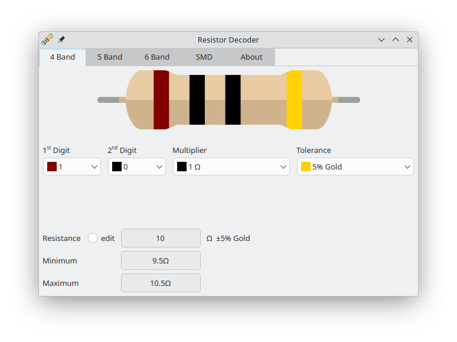
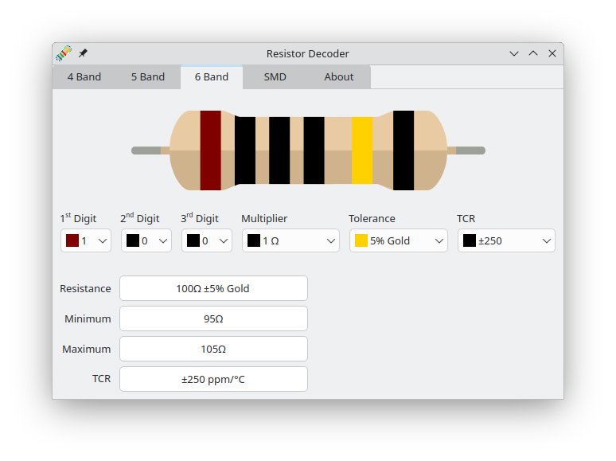

# Resistor​Decoder

This is a code copy (not a fork) from https://github.com/VoxelCubes/ResistorDecoder.  
Its a copy because, there are some infrastructure changes made which may not be very compatible with the original code base.

[](https://www.gnu.org/licenses/gpl-3.0)

This is a standalone Qt GUI tool for color bands on through-hole resistors and number codes on SMD parts.
It supports 3, 4, 5, and 6 band resistors, as well as standard SMD codes, including the EIA-96 standard.

| 3 or 4 Bands | 5 Bands |
|:------------:|:-------:|
|||
| 6 Bands | SMD |
|||

With this version you can also encode resistance values.

## Features
- Encode resistance values
- Decode the resistance and tolerance, as well as the Temperature Coefficient of Resistance (for 6 band resistors).
- Can parse SMD codes¹, including the EIA-96 standard.
- Respects your system's Qt theming.

## Dependencies
PySide6

```
pip install PySide6
```

## Installation


```
git clone https://github.com/AlfredoCubitos/ResistorEnDeCode
cd ResistorDecoder
python main.py
```

## Notes
1. Tolerance values are only standardized for EIA-96 codes and codes with short underlines. Check the manufacturer's datasheet if the tolerance is critical for your application.
